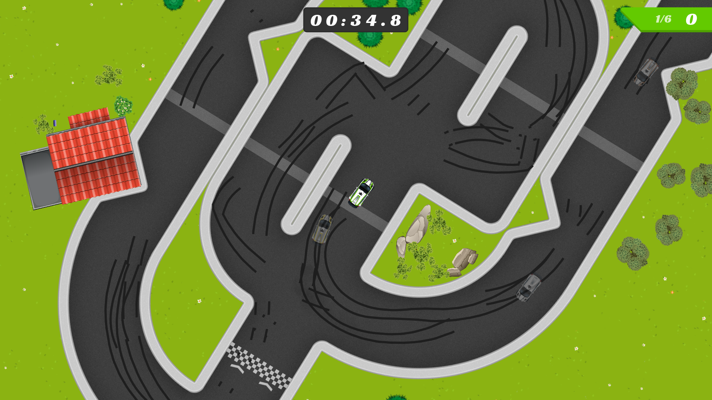

# Screechy Rally

Screechy Rally is a 2D racing game where controlled skids are at the core of the gameplay.
Challenge yourself to unlock medals and beat your personal record.
Or compete with your friends in local multiplayer races (split screen!).

Made with [Godot](https://godotengine.org/)

## Dev Notes

Use of `z_index`:

- 0=ground (road tiles)
- 1=drawing on ground (road surface marking, drift trails, ...)
- 9=ghost cars
- 10=cars
- 15=medium obstacle (bushes, ...) above car
- 20=high obstacles (building, trees, ...) above cars
- 100=in-game UI, like tooltip, player name label

## TODO

Required:

- [x] Add 2 players split screen layout
- [x] Make at least 3 basic maps
- [x] Add maps selection in menu
- [x] Remove Boost
- [x] Victory screen (scores & ranking)
- [x] Ghost best record (for solo mode)
- [x] Control display / config
- [x] Sound volume
- [ ] decorate all maps

Other:

- [x] Redesign in game UI
- [x] Texture background
- [ ] Implement boost/knockback, load with drift
- [x] Pause & back to main menu
- [x] Restart from pause menu
- [x] Mute sound / music
- [ ] Add choice for player count in menu
- [ ] More split screen (3 or 4 players)
- [ ] Network multiplayer
	- [ ] Player name above cars
	- [ ] pseudo / color choice in lobby
- [x] Export web
- [x] Key for restart to last checkpoint
- [-] Display time of last lap(s)
- [x] Display checkpoint status
- [ ] Additional game mode:
  - [ ] (Fixed lap count, arrival ranking)
  - [ ] checkpoint count ranking, no start/finish line, no chrono meter (game duration fixed)
  - [ ] best lap time ranking (game duration fixed)
- [ ] Tournament mode, multiple maps and game mode
- [x] Implement ~SceneManager~ Global.gd to gather scene changing code (start/restart race, quit to menu...)
- [ ] Medal animation in score screen
- [ ] Compare to best time / ghost in score screen
- [x] Disable pause overlay when in score screen
- [ ] Improve engine sound effect
- [ ] Key mapping in main menu (displayed in a bubble above the car?)
- [ ] new road blocks
- [ ] maps environment

## Start Buzzer sound generation

Générer tonalité: Signal carré 400 (600) Hz, 25%, 0.1 (04) sec.
EQ et filtre -> Basse et Aigue: basse 0db - aigue -9db.
Générer silence: 0.5 sec.
Réverbération: Espace moyen + wet uniquement.
Amplification: 12db.

## Catenary-Stamp like icons

draw shape.
generate noise as alpha mask.
	- mix with shape reduced by 1 and smoothed by 0.5.
	- manually create flaw with paint.
apply as alpha to shape.
